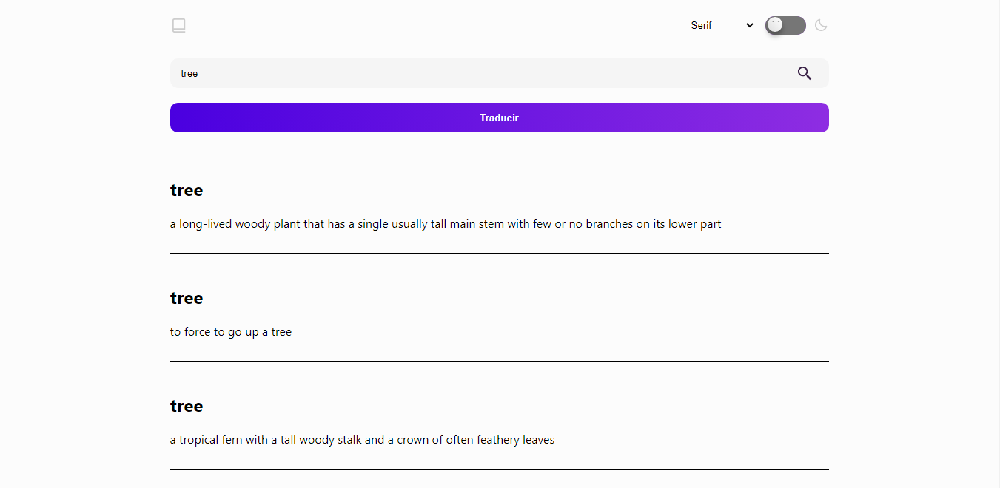
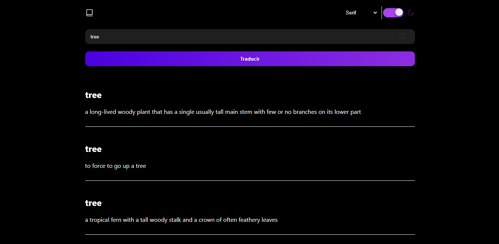
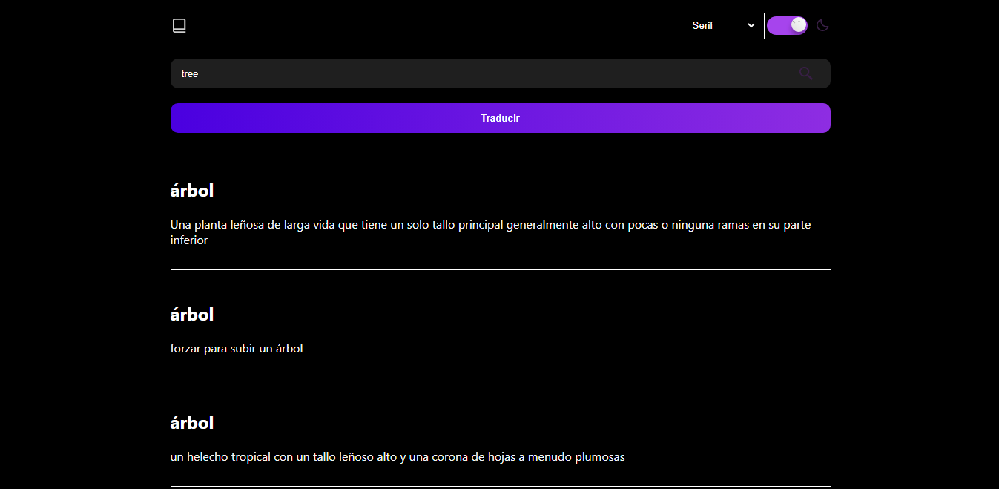

# Dictionary

Esta es una aplicación en los que aplique los siguientes temas:
- React
- useState
- Renderizado condicional
- Apis
 
La aplicación consiste en un buscador de palabras en ingles, los resultados de dicha palabra se los puede traducir al español mediante un boton, posee diferentes fuentes para escoger, y tambien modo dark

---

### Preview

---
[Demo](https://www.example.com)